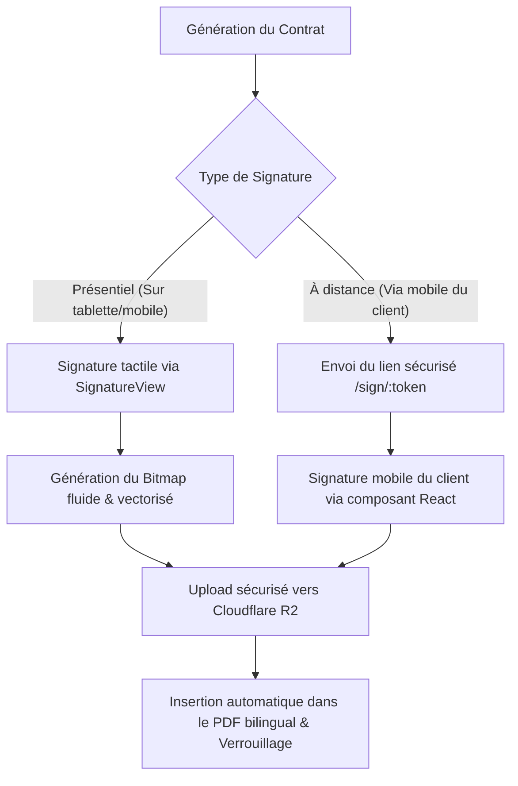

# 🚗 Rentiq System (rentiq-system.com) — SaaS de Gestion de Flotte & Location de Voiture

> **Solution professionnelle de gestion pour agences de location de voitures au Maroc**  
> Une plateforme intégrée combinant une application web de gestion complète, une application mobile native Android pour les opérations sur le terrain, une intégration WhatsApp automatisée et un module de signature électronique sécurisé.

---

## 📌 Table des Matières

1. [Présentation Générale](#1-présentation-générale)
2. [Application Web (Administration & Back-Office)](#2-application-web-administration--back-office)
3. [Application Mobile Android (Opérations Terrain)](#3-application-mobile-android-opérations-terrain)
4. [Module de Signature Électronique](#4-module-de-signature-électronique)
5. [Agent & Bot WhatsApp (Meta Cloud API / Baileys)](#5-agent--bot-whatsapp-meta-cloud-api--baileys)
6. [Synchronisation Google Sheets & Conformité CNDP](#6-synchronisation-google-sheets--conformité-cndp)
7. [Tableau Comparatif : Web vs Mobile](#7-tableau-comparatif--web-vs-mobile)
8. [Guide Technique & Installation (Développeur)](#8-guide-technique--installation-développeur)

---

## 1. Présentation Générale

**Rentiq System (rentiq-system.com)** est un SaaS conçu spécifiquement pour répondre aux besoins opérationnels et légaux des agences de location de voitures au Maroc. Contrairement aux solutions génériques, rentiq-system.com intègre les particularités du marché marocain :
*   **Bilinguisme natif** : Gestion des contrats et interfaces en français et en arabe avec support RTL (Right-to-Left).
*   **Sécurité financière** : Suivi rigoureux des cautions (chèques de garantie, montants, banques émettrices et litiges).
*   **Prévention des risques** : Système interne de Liste Noire (Blacklist) partagée pour signaler les comportements frauduleux ou les mauvais payeurs.

---

## 2. Application Web (Administration & Back-Office)

L'application web est le centre de pilotage destiné aux propriétaires d'agences, gestionnaires et comptables.

### 📊 Tableau de Bord Financier et Opérationnel
*   **Aperçu financier en temps réel** : Chiffre d'affaires journalier, hebdomadaire et mensuel.
*   **Indicateurs d'efficacité** : Rentabilité par véhicule (CA généré par voiture), retours en retard, véhicules loués par rapport aux véhicules disponibles.
*   **Export de données** : Génération de rapports financiers exportables au format CSV pour la comptabilité.

### 📅 Calendrier des Réservations Interactif
*   **Visualisation intuitive** : Planning interactif de type calendrier avec glisser-déposer (Drag & Drop) pour ajuster les dates.
*   **Garantie anti-doublon** : Conflits de réservation bloqués au niveau de la base de données (contrainte d'exclusion PostgreSQL).
*   **Mises à jour instantanées** : Synchronisation en temps réel sur tous les écrans ouverts à l'aide de *Supabase Realtime*.

### 🚗 Gestion du Parc Automobile (Flotte)
*   **Fiche véhicule détaillée** : Immatriculation (plaque marocaine), marque, modèle, année, catégorie de tarif, état (disponible, loué, en maintenance, réservé).
*   **Rapports de dommages** : Journalisation de l'état intérieur/extérieur avec photos horodatées hébergées sur **Cloudflare R2**.
*   **Maintenance préventive** : Déclenchement automatique d'alertes à l'approche des dates d'échéances critiques :
    *   *Assurance automobile.*
    *   *Vignette fiscale annuelle.*
    *   *Visite technique obligatoire.*
    *   *Autres alertes et types de documents personnalisables.*

### 📝 Contrats & Facturation
*   **Génération en un clic** : Création automatique du contrat PDF bilingue (Arabe/Français) à partir d'une réservation.
*   **Suivi des cautions** : Enregistrement des détails du chèque de caution (numéro de chèque, banque et statut : *détenu*, *restitué*, *litige*).
*   **Calcul intelligent du carburant & kilométrage** : Enregistrement du niveau de réservoir et des kilométrages au départ et au retour avec calcul automatique des pénalités éventuelles.

---

## 3. Application Mobile Android (Opérations Terrain)

L'application Android native (développée en Kotlin) permet aux agents sur le terrain (aéroports, parkings) de gérer les entrées et sorties de véhicules en toute mobilité.

### 📲 Fonctionnalités Clés
*   **Tableau de bord optimisé** : Widget d'accueil Android dynamique et graphique financier natif (`FinanceChartView`).
*   **Enregistrement mécanique sur le terrain** :
    *   Ajout de fiches de suivi technique (vidanges, filtres, pneumatiques, courroies, freins).
    *   Signalement d'incidents avec niveau de sévérité et configuration de blocage de location en cas de panne critique.
*   **Prise de vue des dommages** : Capture photo directe avec l'appareil photo du smartphone et téléversement instantané sur Cloudflare R2 pour documenter l'état du départ et du retour.
*   **Recherche et CRM** : Consultation rapide de la liste noire et vérification du statut d'un client par simple saisie de son CIN ou passeport.

---

## 4. Module de Signature Électronique

La signature électronique sur rentiq-system.com élimine complètement l'usage du papier en rendant les contrats légalement clairs et traçables.



### 🖋️ Deux Modes de Signature
1.  **Présentiel (Sur le Mobile de l'Agent)** :
    L'application Android native embarque le composant custom `SignatureView`. Il calcule dynamiquement la vitesse et la pression du tracé pour générer une signature digitale vectorielle ultra-réaliste.
2.  **À Distance (Via Smartphone du Client)** :
    Le système transmet un lien sécurisé unique par WhatsApp ou Email (ex: `/sign/:token`). Le client signe ainsi directement sur son propre écran de smartphone depuis son navigateur avant de récupérer le véhicule.

---

## 5. Agent & Bot WhatsApp (Meta Cloud API / Baileys)

WhatsApp est le canal de communication privilégié au Maroc. Rentiq System intègre un agent connecté pour automatiser le flux opérationnel.

### 🔔 Notifications Automatiques (Push WhatsApp)
Dès qu'une action importante survient, des alertes formatées en temps réel sont transmises au gestionnaire ou au client :
*   **Création** ou **Annulation** de réservation.
*   **Signature électronique confirmée** d'un contrat par le client.
*   **Clôture du contrat** avec récapitulatif du kilométrage final et niveau de carburant au retour.
*   **Signalement de pannes** ou d'alertes de maintenance urgente.
*   **Envoi direct du contrat PDF** : Dès que le contrat est validé, le document est téléchargé depuis Cloudflare R2 et envoyé directement en pièce jointe au format PDF au client.

### 🤖 Bot Auto-Assistant pour Gestionnaires
Un gestionnaire autorisé peut dialoguer directement avec le bot WhatsApp de l'agence.
*   **Passerelle de sécurité stricte** : Le bot identifie l'expéditeur grâce à son numéro de téléphone en base de données. Si le numéro est inconnu, le bot reste totalement silencieux pour garantir la confidentialité opérationnelle.
*   **Commande de Rapport Flash** : En écrivant simplement le mot-clé **`rapport`**, **`report`**, ou **`تقرير`**, le bot génère instantanément un état complet de la flotte en PDF (CA du jour, véhicules loués, alertes de révisions passées) et le renvoie en quelques secondes.
*   **Contrôle de ressources** : Un cooldown anti-spam de 2 minutes par expéditeur et un cache de rapports de 5 minutes évitent les surcharges CPU lors de la génération des PDF.

---

## 6. Synchronisation Google Sheets & Conformité CNDP

Chaque agence peut relier son propre compte Google pour exporter ses données de location à des fins d'analyse ou de partage comptable.

*   **Export Structuré en 6 Onglets** : `Cars` (Véhicules), `Reservations` (Réservations), `Contracts` (Contrats), `Clients` (Clients), `Payments` (Paiements), et `Services` (Maintenance).
*   **Conformité légale CNDP (Loi 09-08)** : Les données personnelles sensibles des clients (ex. numéros de CIN/Passeport, adresses physiques, emails) sont **systématiquement exclues** de l'exportation pour se conformer à la législation nationale sur la protection des données personnelles.
*   **Mise à jour à la demande & Automatique** : La synchronisation s'effectue en un clic via le bouton "Synchroniser" ou périodiquement (toutes les heures) via un service de tâche planifiée (Cron).
*   **Sécurité cryptographique** : Les jetons de connexion Google OAuth sont chiffrés au repos en base de données à l'aide de l'algorithme robuste **AES-256-GCM**.

---

## 7. Tableau Comparatif : Web vs Mobile

| Fonctionnalité | Application Web (React / Administration) | Application Mobile (Kotlin / Terrain) | WhatsApp Bot (Meta API / Services) |
| :--- | :---: | :---: | :---: |
| **Gestion du parc automobile** | Plan complet (Ajout/Modification/Fiches) | Suivi visuel & Consultatif | Notification d'ajout |
| **Calendrier & Planning** | Vue Drag & Drop interactive en temps réel | Liste simplifiée & Création rapide | - |
| **Suivi des chèques de caution** | Registre Central et historique des litiges | Enregistrement de chèques au départ | Notification de caution saisie |
| **Historique des dommages** | Galerie de suivi et historique | Upload de photos direct par caméra | - |
| **Module de maintenance** | Alertes documentaires obligatoires (vignette...) | Log mécanicien direct (vidanges...) | Alertes d'enregistrements |
| **Gestion de la Liste Noire** | Activation et gestion multi-agences | Recherche instantanée par CIN/Passeport | - |
| **Signature électronique** | Envoi de liens à distance et signature Pad | Signature physique tactile sur le terrain | Notification de signature |
| **Statistiques financières** | Dashboard complet & Exports Comptables CSV | Graphique `FinanceChartView` natif | Commande `rapport` (export PDF) |
| **Alertes automatiques** | - | Push Notifications Système | Notifications de contrats & réservations |

---

## 8. Guide Technique & Installation (Développeur)

### Tech Stack

| Couche | Technologie |
| :--- | :--- |
| **Framework Web** | TanStack Start (React 19, Vite 8) |
| **Application Mobile** | Android native (Kotlin, SDK minimal 26) |
| **Base de Données / Auth / Temps Réel** | Supabase (PostgreSQL, sécurité multi-locataire RLS) |
| **Stockage Fichiers** | **Cloudflare R2** (Compatible S3 — photos de dommages, CIN scannés, contrats PDF) |
| **Génération PDF** | React-PDF |
| **Serveur de Bot WhatsApp** | Node.js (contenant Baileys / Meta API) |
| **Hébergement Web** | **Vercel** / Node HTTP Server standard |

---

### Configuration Locale (Web App)

#### 1. Installation des dépendances
```bash
npm install
```

#### 2. Configuration des variables d'environnement
Créez un fichier `.env` sur le modèle de `.env.example` et renseignez les valeurs nécessaires :
*   **Supabase** : `VITE_SUPABASE_URL`, `VITE_SUPABASE_ANON_KEY`, `SUPABASE_SERVICE_ROLE_KEY`
*   **R2** : `R2_ACCOUNT_ID`, `R2_ACCESS_KEY_ID`, `R2_SECRET_ACCESS_KEY`, `R2_BUCKET`, `R2_PUBLIC_URL`
*   **Google OAuth** (Optionnel, requis pour Google Sheets Sync) : `GOOGLE_OAUTH_CLIENT_ID`, `GOOGLE_OAUTH_CLIENT_SECRET`, `GOOGLE_OAUTH_REDIRECT_URI`, `SHEETS_TOKEN_KEY`, `CRON_SECRET`

#### 3. Migration Base de Données
Appliquez les schémas SQL dans votre instance Supabase :
*   `supabase/migrations/0001_init.sql` (Tables & contraintes)
*   `supabase/migrations/0002_rls.sql` (Politiques de sécurité au niveau des lignes)

#### 4. Lancer le projet en développement
```bash
npm run dev
```
L'application web sera disponible sur `http://localhost:3000`.

---

### Configuration spécifique : Cloudflare R2

Les photos de dommages et les documents sont chargés en accès direct à R2 depuis le navigateur (presigned PUT).
Pour éviter les erreurs CORS :
1.  Allez dans Cloudflare R2 → Bucket de l'application → **Settings** → **CORS Policy**.
2.  Copiez-y le contenu du fichier `r2-cors.json` (remplacez les domaines de préproduction ou de localhost par vos domaines de production réels).
3.  Activez l'accès public en lecture sur le bucket (par exemple par sous-domaine `r2.dev` ou nom de domaine personnalisé) et configurez `R2_PUBLIC_URL` sur cette adresse.

---

### Configuration Supabase Realtime

Pour profiter des rafraîchissements instantanés sur l'application Web et Mobile :
1.  Rendez-vous dans Supabase → **Database** → **Replication** → **`supabase_realtime`**.
2.  Activez la réplication sur les tables `vehicles`, `reservations`, `contracts`, `clients`, et `notification_queue`.

---

### Déploiement Production

Le build génère un serveur Fetch standard (`dist/server/server.js`) et des assets statiques pour le client (`dist/client`). Le script `server.mjs` fait tourner le tout sous forme de serveur Node standard.

```bash
npm ci && npm run build
npm start
```
*Le serveur écoutera sur le port défini par le système (3000 par défaut).*

---

### Architecture Multi-Tenancy (Multi-Conteneur / Multi-Agence)

La séparation des données entre les agences est assurée au niveau le plus bas via le champ `agency_id`. Chaque table possède une politique de sécurité (RLS) active restreignant l'accès en lecture et écriture uniquement aux membres associés à cet identifiant d'agence via la fonction utilitaire PostgreSQL `is_agency_member()`. Le jeton de rôle de service (`Service Role Token`) Supabase n'est utilisé que lors de la phase d'onboarding pour créer un compte administrateur d'agence.
