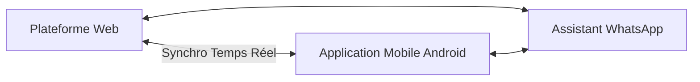

# 🚗 Rentiq System — SaaS de Gestion de Flotte & Location de Voiture

> **La plateforme de référence pour les agences de location de voitures au Maroc**  
> Une solution cloud intégrée connectant votre back-office web, vos agents sur le terrain via l'application mobile Android, et vos clients grâce à un assistant WhatsApp automatisé et un système de signature électronique.

---

## 📌 Table des Matières

1. [À Propos de Rentiq System](#1-à-propos-de-rentiq-system)
2. [L'Écosystème Rentiq](#2-lécosystème-rentiq)
3. [L'Application Web (Pilotage & Back-Office)](#3-lapplication-web-pilotage--back-office)
4. [L'Application Mobile Android (Opérations Terrain)](#4-lapplication-mobile-android-opérations-terrain)
5. [Le Module de Signature Électronique Securisée](#5-le-module-de-signature-électronique-securisée)
6. [Intégration & Assistant Intelligent WhatsApp](#6-intégration--assistant-intelligent-whatsapp)
7. [Garanties de Sécurité & Conformité CNDP](#7-garanties-de-sécurité--conformité-cndp)
8. [Comparatif des Fonctionnalités : Web vs Mobile](#8-comparatif-des-fonctionnalités--web-vs-mobile)

---

## 1. À Propos de Rentiq System

**Rentiq System (rentiq-system.com)** est une plateforme professionnelle conçue spécialement pour moderniser et sécuriser l'activité des agences de location de voitures au Maroc. 

Le système répond directement aux défis quotidiens des agences locales :
*   **Protection contre la fraude** : Liste noire (Blacklist) interne avec système de signalement des profils à risque.
*   **Gestion des cautions** : Traçabilité complète des chèques de garantie (n° de chèque, banque, statut).
*   **Bilinguisme intégral** : Contrats et factures officiels générés instantanément en bilingue Arabe/Français.

---

## 2. L'Écosystème Rentiq

Rentiq System rassemble trois piliers majeurs au sein d'une unique interface sécurisée :

---

## 3. L'Application Web (Pilotage & Back-Office)

Destinée aux administrateurs de l'agence, la plateforme Web centralise toutes les opérations.

### 📈 Tableau de Bord et Décisions
*   **Indicateurs financiers** : Visualisation du chiffre d'affaires (journalier, hebdomadaire, mensuel).
*   **Suivi de performance** : Rentabilité nette par voiture pour optimiser le retour sur investissement du parc.
*   **Exports faciles** : Extraction des données financières en CSV pour simplification de la comptabilité.

### 📅 Agenda de Réservation Réel-Temps
*   **Frictions évitées** : Calendrier interactif avec ajustements intuitifs (Drag & Drop).
*   **Zéro Double Réservation** : Des barrières de sécurité automatiques éliminent tout risque de surréservation d'un véhicule.

### 🚗 Suivi du Parc Automobile
*   **Alertes automatiques** : Notifications à l'approche de la fin de validité des pièces administratives obligatoires (Assurance, Vignette fiscale, Visite technique).
*   **Journal des dommages** : Suivi historique avec photographies illustrant chaque état de véhicule avant et après location.

---

## 4. L'Application Mobile Android (Opérations Terrain)

L'application Android native accompagne vos agents sur le terrain pour fluidifier et accélérer les départs et retours de véhicules.

*   **Enregistrement mécanique rapide** : Déclaration des entretiens courants (vidanges, filtres, pneumatiques, freins) et signalement d'incidents (panne, casse) directement depuis le véhicule avec estimation de sévérité.
*   **Contrôle visuel par Image** : Photographie de l'état du véhicule et chargement direct dans le cloud sécurisé de l'agence.
*   **Recherche CRM express** : Vérification instantanée de l'historique et du statut "Liste Noire" d'un client par simple saisie de son CIN ou de son numéro de passeport.

---

## 5. Le Module de Signature Électronique Securisée

La signature dématérialisée simplifie la logistique tout en assurant l'authenticité et la validité de chaque contrat.

*   **Signature sur Place** : Le client signe directement sur l'écran tactile du smartphone de l'agent lors de la mise à disposition de la voiture via un outil de tracé vectoriel haute précision.
*   **Signature à Distance** : Envoi d'un lien sécurisé unique au client lui permettant de signer directement via son propre mobile, en ligne, avant de récupérer son véhicule.
*   **Validation Légale** : La signature est fusionnée de manière indélébile au bas du document PDF de location avec un repère d'horodatage strict.

---

## 6. Intégration & Assistant Intelligent WhatsApp

Pour accélérer la relation client et simplifier la vie des gérants, Rentiq System utilise la puissance de l'API WhatsApp.

*   **Notifications de Gestion** : Réception automatique d'alertes WhatsApp à chaque modification importante (nouvelle réservation, contrat finalisé, retour effectué).
*   **Envoi Client Instantané** : Expédition automatique du contrat PDF finalisé directement sur le numéro WhatsApp du locataire.
*   **Le Bot Interactif (Pour les Gérants)** :
    *   *Sécurité* : Seuls les numéros de téléphone pré-enregistrés de l'agence sont autorisés à communiquer avec le bot.
    *   *Commande simple* : Envoyez le mot-clé **`rapport`** ou **`تقرير`** au bot et recevez en quelques secondes le rapport complet d'activité de la flotte en PDF (revenus, disponibilité, interventions mécaniques du jour).

---

## 7. Garanties de Sécurité & Conformité CNDP

Locar/Rentiq System accorde une importance primordiale à la conformité réglementaire et à la vie privée :

*   **Conformité avec la Loi 09-08 (Maroc)** : Tous les exports de données (tels que la synchronisation optionnelle vers Google Sheets) excluent de façon stricte les données personnelles sensibles de vos clients (CIN, adresses, emails).
*   **Confidentialité** : Les accès sont limités par des rôles définis (Propriétaire, Agent, Comptable) garantissant la protection des informations commerciales sensibles de chaque agence.

---

## 8. Comparatif des Fonctionnalités : Web vs Mobile

| Fonctionnalité | Plateforme Web (Gestion) | Code Mobile Android (Terrain) | Assistant Bot WhatsApp |
| :--- | :---: | :---: | :---: |
| **Gestion administrative flotte** | Complète (Créer/Modifier les fiches) | Consultative | Rapport instantané |
| **Planning & Réservations** | Calendrier Drag & Drop complet | Liste & Création rapide de dossier | Notification immédiate |
| **Enregistrement des Cautions** | Registre complet et historique des litiges | Saisie simple du chèque de caution | Suivi automatisé |
| **Photos de Dommages** | Consultation de la galerie par contrat | Capture et envoi par caméra en direct | - |
| **Signatures de Contrats** | Envoi de liens à distance sécurisés | Tracé sur écran tactile en direct | Avis de confirmation signé |
| **Synchronisation Tableurs** | Oui (Google Sheets anonymisé) | - | - |
| **Statistiques et Rapports** | Tableaux financiers complets & CSV | Graphiques de revenus intégrés | Envoi de rapport PDF interactif |
